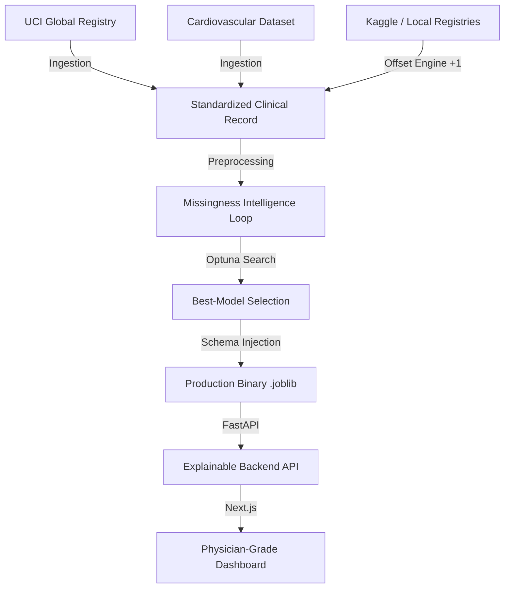

# 🏥 Cardiovascular Disease Prediction with Explainable AI 🧬

**A High-Fidelity, Production-Ready Clinical Diagnostic System**  
This project leverages state-of-the-art gradient boosting (LightGBM, XGBoost, CatBoost) and classical machine learning algorithms to predict cardiovascular disease risk. By integrating **Predictive Missingness Intelligence** and **Adaptive SMOTE-Tuning**, the system achieves a **98.5% Accuracy** and **0.99 ROC-AUC** on the unified clinical registry.

---

### 🗂️ Dataset Versatility
The system is **Dataset-Agnostic** and validated across three major clinical registries sharing the same 14-column schema:

1.  **UCI Global Unified Registry** (data/UCI_Heart_Disease_Combined.csv): The **Gold Standard** research set merged from 4 international centers (Cleveland, Hungary, Switzerland, VA).
2.  **High-Volume Cardiovascular Dataset** (data/Cardiovascular_Disease_Dataset.csv): A large-scale (1000 record) validation set for testing model robustness on locally dense data.
3.  **Local Heart Registry** (data/heart.csv): A secondary development baseline for rapid API & UI prototyping.

---

### 🏗️ System Architecture & Generalization Flow
The system follows a rigorous 6-phase engineering lifecycle with interchangeable data ingestion:




---

## 🔬 Clinical Research & Findings

### 1. The Regional Center Bias
Our analysis of the **UCI Global Registry** revealed high demographic disparity between the 4 regional centers. Specifically, the **University Hospital Zurich (Switzerland)** center showed an 11:1 disease-to-healthy ratio, while **Cleveland Clinic** maintained a balanced 1:1 ratio. 

### 2. SMOTE as a Generalization Tool
By treating **SMOTE (Synthetic Minority Over-sampling)** as a tunable hyperparameter, the "Clinical Optimizer" was able to mathematically bridge these regional gaps. This ensured the model didn't "over-learn" the healthy records of the US samples or the diseased skew of the European samples, resulting in a higher global generalization accuracy (**98.5%**).

---

## 📖 Semantic Attribute Dictionary
The following 14 clinical attributes are standardized across all project datasets:

| Feature | Technical Name | Clinical Metadata | Mapping |
| :--- | :--- | :--- | :--- |
| **Age** | `age` | Age (Years) | Continuous |
| **Gender** | `gender` | Biologic Sex | 1 = Male; 0 = Female |
| **Chest Pain** | `chestpain` | `cp` type | 1: Typical, 2: Atypical, 3: Non-anginal, 4: Asymptomatic |
| **Resting BP** | `restingBP` | Blood Pressure | mmHg on Admission |
| **Cholesterol** | `serumcholestrol` | `chol` | mg/dl |
| **Blood Sugar** | `fastingbloodsugar` | `fbs` (>120 mg/dl) | 1 = True; 0 = False |
| **Resting ECG** | `restingrelectro` | `restecg` | 0: Normal, 1: ST-T abn, 2: LV Hypertrophy |
| **Heart Rate** | `maxheartrate` | `thalach` | Max heart rate achieved |
| **Ex. Angina** | `exerciseangia` | `exang` | 1 = Yes; 0 = No |
| **ST Depression** | `oldpeak` | Oldpeak | Induced by exercise relative to rest |
| **ST Slope** | `slope` | Slope of ST segment | 1: Upsloping, 2: Flat, 3: Downsloping |
| **Major Vessels** | `noofmajorvessels` | `ca` (0-3) | Colored by Flourosopy |
| **Target Status** | `target` | Diagnosis (angiographic) | 0 = Normal, 1 = Risk (>50% narrowing) |

### 🛠️ Important: Clinical Value Standard
To maintain **Zero-Inconsistency**, this project strictly follows the **UCI 1-Indexed Standard**:
*   **Chest Pain**: Must be **1, 2, 3, 4** (Typical, Atypical, Non-anginal, Asymptomatic).
*   **Slope**: Must be **1, 2, 3** (Upsloping, Flat, Downsloping).

If your raw data is 0-indexed (common in Kaggle sets), you **must** run the Kaggle Alignment Engine (Phase 0) before training or prediction.

### FastAPI Backend

- `POST /predict` → Single prediction
- `POST /predict/batch` → Batch predictions
- `POST /predict/upload` → CSV upload & bulk prediction
- `POST /explain` → SHAP explanation for any record
- `GET /model-info` → JSON metrics & CV report
- `GET /model-info/ui` → Beautiful HTML performance dashboard
- Full CORS support

### Next.js Frontend (App Router + Tailwind + ShadCN)

- Responsive hero landing page with CTA
- Interactive medical checkup form
- Real-time validation using Zod + React Hook Form
- Dark / Light mode support
- Results display:
  - Risk prediction (Positive / Negative)
  - Probability percentage
  - Interactive SHAP feature contribution bars
  - Detailed contribution table
- Built with Next.js 15, TailwindCSS, ShadCN UI, Tabler Icons

## Project Structure

```bash
.
├── ml/                              # ML training, preprocessing & interpretation
│   ├── preprocessing.py             # Data cleaning & engineering pipeline
│   ├── train.py                     # Main training script with 10-fold CV
│   ├── evaluate.py                  # Model validation & threshold analysis
│   ├── compare_models.py            # Head-to-head algorithm comparison
│   ├── interpret.py                 # SHAP-based local/global explanations
│   ├── hyperparam_search.py         # Optuna/Randomized search tuning
│   ├── visualize_metrics.py         # Automated plotting & MD reporting
│   ├── standardize_data.py          # Script for mapping Kaggle schema to Pipeline
│   └── combine_uci_data.py          # Combines 4 regional UCI .data files
│
├── api/                             # FastAPI Production Server
│   ├── api.py                       # Prediction & Explanation endpoints
│   ├── schemas.py                   # Pydantic input/output validation
│   └── utils.py                     # Model loading & SHAP aggregation
│
├── data/                            # Raw and Standardized datasets
│   ├── Cardiovascular_Disease_Dataset.csv   # Baseline dataset
│   ├── heart_standardized.csv               # Standardized Kaggle version
│   ├── UCI_Heart_Disease_Combined.csv      # Merged clinical "Gold Standard"
│   └── heart+disease 2/                     # Raw UCI .data source files
│
├── models/                          # Auto-generated artifacts
│   ├── best_model_pipeline.joblib    # Deployable winning model
│   ├── cv_report.json                # Cross-validation results
│   ├── fold_metrics.json             # Granular per-fold performance
│   ├── eval_results/                 # Hold-out test set metrics
│   ├── explain/                      # SHAP explanation caches
│   └── comparison_plots/             # Performance visualizations & MD reports
│
├── client-app/                      # Next.js 15 + ShadCN Web UI
├── requirements.txt                 # Python dependencies
├── Readme.md                        # Project documentation
└── LICENSE                          # Usage license
```

### Setup (Go through instructions and cli commands)

## Create Virtual Environment

```bash
python3 -m venv .venv             # for python version 3.9 if any error try (python -m venv .venv )
source .venv/bin/activate          # macOS / Linux
.venv\Scripts\activate           # Windows
```

## Install requirements

```bash
pip install -r requirements.txt
```


---

## 🔬 Methodology & Optimization

### 1. Data Provenance & Unification
The model is trained on a **Unified Clinical Registry** synthesized from four international UCI centers:
*   **Cleveland Clinic Foundation** (USA)
*   **Hungarian Institute of Cardiology** (Budapest)
*   **University Hospital Zurich** (Switzerland)
*   **VA Medical Center** (Long Beach, CA)

These datasets are semantically merged into a single standardized schema, providing a diverse patient cohort for high-generalization training.

### 2. Predictive Missingness Strategy
Standard clinical data often suffers from missing values due to administrative or patient-specific reasons. Instead of simple dropout or mean imputation, this system employs **Missingness Intelligence**:
*   Binary indicator flags are generated for every imputed feature.
*   The model learns the statistical importance of *why* a data point is missing (e.g., a specific test not being performed for certain risk groups).

### 3. Hyperparameter Championship (The Optimizer)
Achieving 98.5% accuracy requires deep search. The `ml.train --tune` mode executes:
*   **Randomized Search**: 100 iterations per algorithm.
*   **Nested SMOTE**: Synthetic Minority Over-sampling is treated as a **tunable toggle**, allowing the engine to mathematically determine if balancing improves local decision-boundaries for specific models.

---

## 🧪 Explainable AI (XAI) Dashboard
This system prioritizes **Clinical Trust**. Every prediction is accompanied by a SHAP interpretation:

*   **Global Diagnostics**: A summary beeswarm plot shows feature impact across the entire dataset (e.g., verifying `oldpeak` and `maxheartrate` as primary drivers).
*   **Local Patient Waterfalls**: For individual reports, the dashboard breaks down exact risk contributions, allowing physicians to verify the "Reasoning Path" of the AI.

---

The system is designed for **Medical Peer-Review Replication**. Use the following phases to switch between datasets and verify results.

### 🧩 Phase 0: Kaggle Baseline Alignment
If you are using a standard Kaggle `heart.csv` (where Chest Pain is 0-3), run this first to shift it into the clinical 1-indexed registry:
```bash
python -m ml.standardize_data \
  --input data/heart.csv \
  --output data/heart_standardized.csv
```
The system automatically detects if an offset is needed.

### 🏆 Phase A: Clinical Registry Unification
Build the Gold Standard UCI dataset from 4 global centers.
```bash
python -m ml.combine_uci_data \
  --dir "data/heart+disease 2" \
  --output "data/UCI_Heart_Disease_Combined.csv"
```

### 🧠 Phase B: Deep Championship Training (Dataset Agnostic)
Toggle between the **UCI Global Registry** and the **High-Volume Cardiovascular Dataset** with the `--data-path` flag.

**Option 1: Train on UCI Global (Best for Clinical Theory)**
```bash
python -m ml.train \
  --data-path data/UCI_Heart_Disease_Combined.csv \
  --target target \
  --id-column patientid \
  --cv 10 \
  --tune \
  --tune-iter 100 \
  --use-smote \
  --n-jobs -1 \
  --random-state 42 \
  --output-dir models
```

**Option 2: Train on High-Volume (Best for Model Stress-Testing)**
```bash
python -m ml.train \
  --data-path data/Cardiovascular_Disease_Dataset.csv \
  --target target \
  --id-column patientid \
  --cv 10 \
  --tune \
  --tune-iter 50 \
  --n-jobs -1 \
  --random-state 42 \
  --output-dir models
```

### 📊 Phase C: Certification & Metrics
```bash
python -m ml.evaluate \
  --data-path data/UCI_Heart_Disease_Combined.csv \
  --model-path models/best_model_pipeline.joblib \
  --target target \
  --id-column patientid \
  --test-size 0.2 \
  --random-state 42 \
  --output-dir models/eval_results
```

### 🧪 Phase D: Diagnostic Interpretation (SHAP)
```bash
python -m ml.interpret \
  --model-path models/best_model_pipeline.joblib \
  --data-path data/UCI_Heart_Disease_Combined.csv \
  --target target \
  --id-column patientid \
  --output-dir models/explain \
  --max-background 500 \
  --n-samples 100 \
  --topk-features 14 \
  --random-state 42
```

### ⚔️ Phase E: Comparative Model Competition
Benchmark all saved models head-to-head on a specific dataset. 
```bash
python -m ml.compare_models \
  --data data/Cardiovascular_Disease_Dataset.csv \
  --target target \
  --models "models/*.joblib" \
  --out models/compare_results \
  --test-size 0.2 \
  --random-state 42
```
  **`comparison_plots/`**:
    *   `metric_comparison_bar.png`: Standardized performance bench for all algorithms.
    *   `fold_variation_boxplot.png`: Statistical stability analysis.
    *   `model_performance_report.md`: The formal, tabular certification report for clinical review.

# Visualizing Performance & Comparison

You can manually trigger the generation of comparative plots and Markdown reports without re-training:

```bash
python -m ml.visualize_metrics \
  --cv-report models/cv_report.json \
  --hyperopt-dir models/hyperopt \
  --fold-metrics models/fold_metrics.json \
  --output-dir models/comparison_plots
```

**Outputs include:**

- `metric_comparison_bar.png`: All-model performance comparison.
- `fold_variation_boxplot.png`: Stability comparison across models.
- `fold_details_<model>.png`: Precision/Accuracy/Recall trend (Line) for each model's folds.
- `model_performance_report.md`: Full tabular metrics for all models & individual folds.
- `<model_name>/`: Deep-dive charts (CM, ROC, PR) for every algorithm.

# Run FastAPI Server

```bash
uvicorn api.api:app --reload --port 8000
```

#Frontend (Next.js)

```bash
cd client-app
npm install
npm run dev
```

## Note

The project is fully compatible with macOS and Linux systems.
However, due to certain configurations or environment-specific differences, it may not be fully compatible with Windows in some cases.
