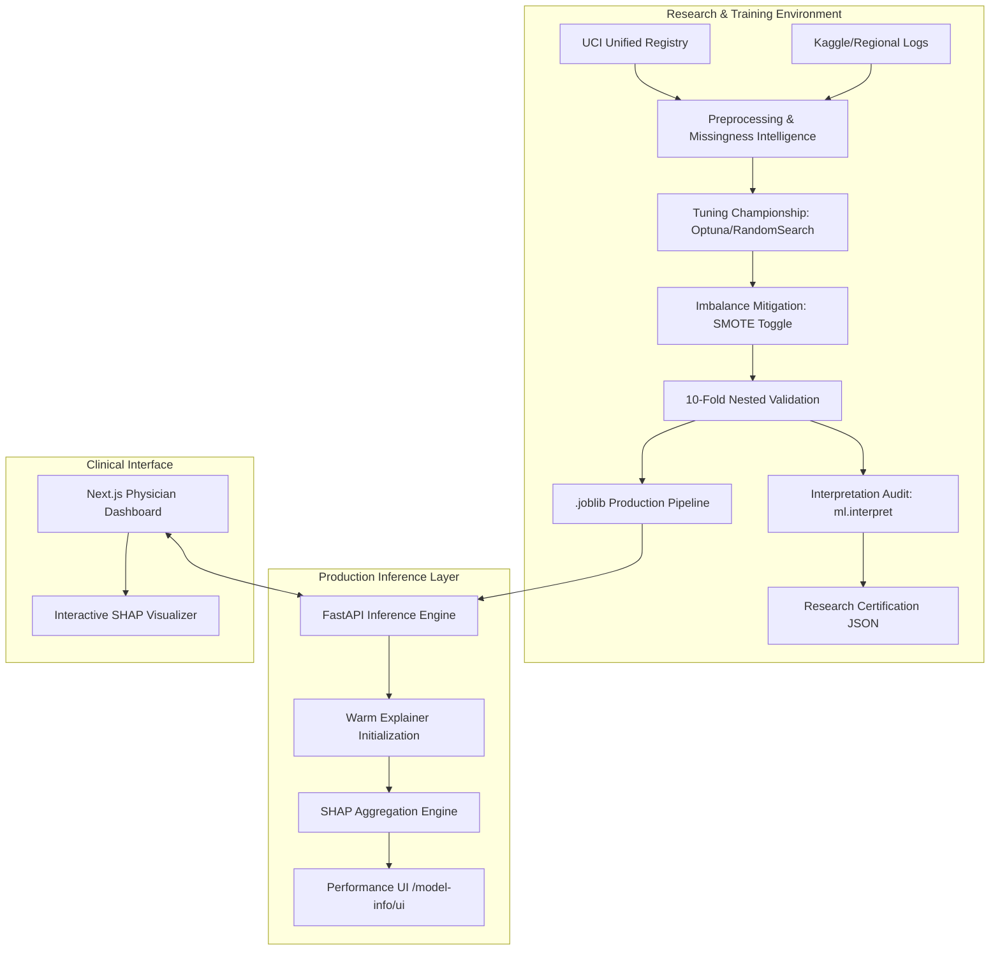

# Heart Disease Prediction: System Design Documentation

This document provides a detailed technical breakdown of the Cardiovascular Disease Prediction platform, from the high-level system architecture to the individual clinical logic components.

---

## 1. Macroscopic View: System Architecture (XAI-First)

The platform is designed as an **Explainable-First** ecosystem. Every prediction is backed by a mathematical "Reasoning Path" (SHAP), bridging the gap between "Black Box" algorithms and clinical accountability.

### 🏛️ Global Overview
The system bridges the gap between raw medical data and physician-level insights by orchestrating three primary layers:
1.  **Clinical Physician UI (Next.js 15)**: A high-fidelity dashboard for medical professionals to input patient data and visualize AI reasoning.
2.  **Explainable Backend (FastAPI)**: A high-performance inference engine that serves predictions and real-time SHAP-based feature contributions.
3.  **Research-Grade ML Pipeline (Scikit-learn/XGBoost)**: A rigorous automated engine for data cleaning, hyperparameter optimization, and model validation.

### 🖼️ System Diagram


### 🛠️ Tech Stack Taxonomy
| Layer | Technologies |
| :--- | :--- |
| **Frontend** | Next.js 15, TailwindCSS, ShadCN UI, Chart.js, Zod, React Hook Form |
| **Backend API** | FastAPI, Pydantic, Joblib, Uvicorn |
| **ML Engine** | XGBoost, LightGBM, CatBoost, Scikit-learn, Imbalanced-learn |
| **XAI (Explainability)** | SHAP (SHapley Additive exPlanations) |
| **Optimization** | Optuna, RandomSearchCV |
| **Monitoring** | Matplotlib, Seaborn, Automated Markdown Certification |

---

## 2. Mesoscopic View: Data Flow & Lifecycle

### 🔄 Training Lifecycle (The Gold Room Protocol)
1.  **Ingestion**: Raw clinical records are loaded and mapped to the **14-Column Centralized Clinical Schema**.
2.  **Pre-Isolation**: 20% of the data is strictly sequestered for "Gold Isolation" testing; it never touches the training or tuning loops.
3.  **Nested Search & Balancing**: The 80% Development set undergoes nested cross-validation. During this, **Adaptive SMOTE-Tuning** determines if oversampling improves local decision boundaries for specific patient folds.
4.  **Championship**: Multiple algorithms (XGB, LGBM, RF, CatBoost) compete. The "Winner" is selected based on **ROC-AUC** (primary) and **SMOTE-Optimization** outcomes.
5.  **Certification**: The system automatically generates a `research_certification.json` and a comprehensive `model_performance_report.md` with stability metrics.

### 🔍 XAI Post-Training Auditing
- **Interpretation Audit**: The system runs `ml.interpret` to generate global beeswarm and waterfall plots for "uncertain" samples (probabilities near 0.5), auditing for potential bias before certification.
- **Certification**: The system automatically generates a research certification sealed with these SHAP diagnostics.

### 🧠 Inference Lifecycle
1.  **Request**: A physician submits a patient record via the Next.js form.
2.  **Validation**: Zod performs real-time clinical boundary checks (e.g., ensuring `serumcholestrol > 0`).
3.  **Normalization**: The FastAPI backend maps biological sex (M/F) and ensures regional offsets (e.g., Kaggle 0-indexed CP to Clinical 1-indexed CP).
4.  **Transformation**: The `.joblib` pipeline applies imputation (with indicator flags) and scaling.
5.  **Prediction**: The model returns a binary risk (Positive/Negative) and a probability score.
6.  **Explanation**: The system triggers a **SHAP local interpretation**, generating feature impact weights for that specific patient.

---

## 3. Microscopic View: Core Logic Components

### 📝 Clinical Schema Standard (The Single Source of Truth)
To prevent "Data Drift" and "Schema Inconsistency," the system enforces a strict 1-indexed clinical standard via `ml/schema.py`:
- **Chest Pain (`chestpain`)**: (1: Typical, 2: Atypical, 3: Non-anginal, 4: Asymptomatic).
- **ST Slope (`slope`)**: (1: Upsloping, 2: Flat, 3: Downsloping).
*Micro-Innovation*: The `ml/standardize_data.py` engine automatically detects 0-indexed data and applies a `+1` offset to ensure clinical alignment.

### 🕵️ Predictive Missingness Intelligence
Instead of simple dropout or mean imputation, the pipeline uses `SimpleImputer(add_indicator=True)`.
- **The Micro-Logic**: For features like `serumcholestrol`, the system creates a hidden feature `chol_is_missing`.
- **Reasoning**: In clinical settings, a "Missing" cholesterol test might correlate with specific patient demographics or severity levels. The models (XGBoost/CatBoost) are trained to find statistical significance in the *absence* of data.

### 🏆 Model Championship (Adaptive SMOTE)
Within `ml/hyperparam_search.py`, **SMOTE** is a first-class **Tuning Parameter**.
- **ImbPipeline Logic**: The system uses `imblearn.pipeline.Pipeline` to ensure SMOTE is only applied to the **Training Folds**.
- **Leakage Prevention**: Synthetic points are **never** injected into the validation folds, ensuring that accuracy metrics are pure and not artificially inflated by synthesized data.
- **Tuning Space**:
```python
"smote": [None, SMOTE(random_state=42)]
```
This allows the optimization engine to mathematically prove whether synthetic balancing is required for a specific algorithm.

### 📐 SHAP Evaluation Architecture (XAI)
To ensure **Clinical Trust**, the system manages explainability across two distinct phases:

#### 1. Offline (Batch) Evaluation: `ml/interpret.py`
This process is used for auditing and research certification during the "Gold Room" phase.
- **Explainer Choice**: The system detects the algorithm type. **TreeExplainer** is preferred for the ensemble (XGB, LGBM, CatBoost) as it calculates exact SHAP values by traversing the tree nodes, resulting in high speed and mathematical precision.
- **Background Modeling**: When the model is not tree-based, the system falls back to **KernelExplainer**. It identifies a "Maximum Background" (default 500 samples) to represent the "Reference Human" expected value.
- **Artifacts**: It generates **Beeswarm** plots for global feature importance and **Waterfall** plots for "Uncertain Samples" (records where the model predicted a probability near 0.5) to analyze why the AI was nearly undecided.

#### 2. Online (Inference) Evaluation: `api/api.py` & `api/utils.py`
The API implements a **"Warm Explainer"** pattern to ensure near-zero latency for physician requests.
- **Startup Injection**: On app launch, the `build_shap_explainer_if_possible` function inspects the loaded `.joblib` pipeline.
- **Pipeline Preservation**: The explainer is built specifically for the **Inner Classifier** step. Before explaining, the single input is passed through the `preprocessor` to maintain the feature alignment.
- **The Aggregation Micro-Engine**: Since the model operates on "Transformed Reality" (one-hot encoded columns like `cat__chestpain_2`), the API runs a recursive regex summation:
  - **Input**: `{'cat__chestpain_4': 0.8, 'cat__chestpain_2': -0.1, 'num__age': 0.05}`
  - **Micro-Logic**: `agg[key.split('__')[-1].split('_')[0]] += value`
  - **Output**: `{'chestpain': 0.7, 'age': 0.05}`
- **Physician Presentation**: The final result is a list of **Top K Impacts**, allowing the UI to render the "Heart Rate" bar as a single factor, even if it was internally split or missing.

---

## 4. Verification & Certification

### 📑 Research Certification JSON
Every model artifact is accompanied by a `research_certification.json` that acts as a secure "Seal of Quality," containing:
- Sample sizes (Dev vs Gold Isolation).
- Random states used for reproducibility.
- Nested CV performance statistics.

### 📈 Automated Reporting
The `ml/visualize_metrics.py` script serves as the "Post-Training Auditor," generating:
- **`metric_comparison_bar.png`**: Head-to-head algorithm benchmarks.
- **`fold_variation_boxplot.png`**: Statistical stability across the 10 folds.
- **`model_performance_report.md`**: A full tabular breakdown for clinical review.
